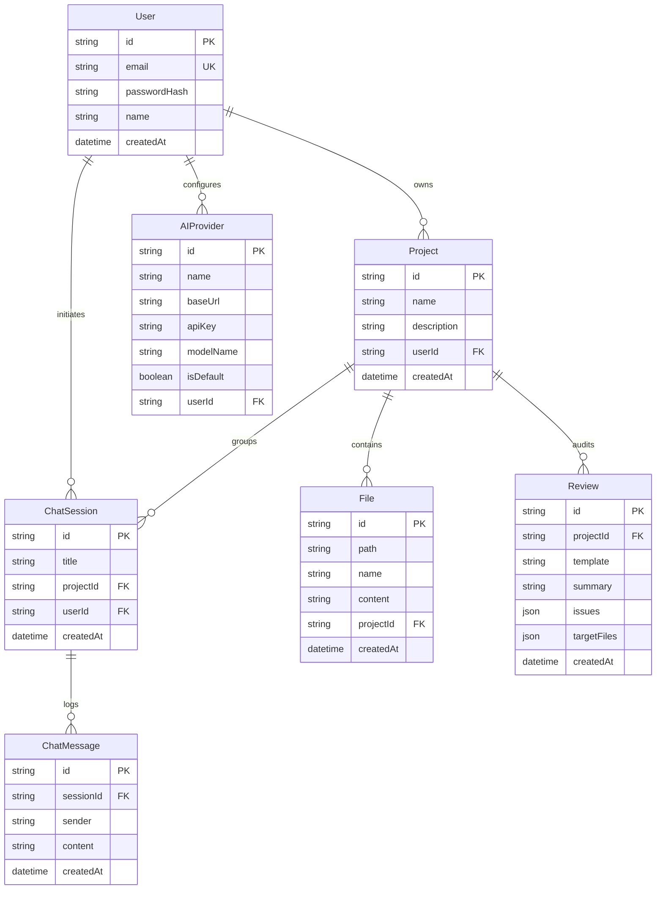
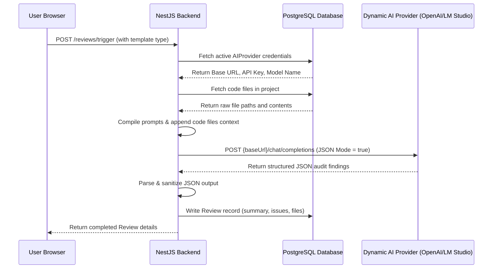

# Architecture Document - AI-Powered Code Review Assistant

This document outlines the software architecture, database design, API structures, and AI integration flows implemented in the **AI-Powered Code Review Assistant**.

---

## 1. Frontend Architecture

The frontend is built on **Next.js 15 (App Router)** in **TypeScript**, styled with **Tailwind CSS**. It uses a single-page workspace layout split into three distinct modules to maximize screen space for reviewing code.

### Core Architecture Components
- **AuthProvider (`src/context/AuthContext.tsx`)**: Controls global session status. Automatically intercepts client-side routing, redirecting unauthenticated users to `/login` and authenticated users to `/dashboard`.
- **API Wrapper (`src/lib/api.ts`)**: An asynchronous fetch interceptor. Reads the active JWT from `localStorage` and appends it to outgoing requests. Wraps server response errors in standard client exceptions.
- **Three-Pane Workspace Component (`src/app/projects/[id]/page.tsx`)**:
  - **Left Pane (File Tree)**: Directory browser that displays subdirectories. Uses custom path parsing logic to translate raw file path entries into folder tree nodes recursively.
  - **Middle Pane (Code Viewer)**: Highlights file code text. Triggers `Prism.highlightAll()` on active file updates, providing context-aware syntax highlighting.
  - **Right Pane (Control Desk)**: Holds tabs for triggering audits (Security, Performance, Quality), chatting with the codebase, and scanning for Technical Debt or Architecture layouts.
- **Review History (`src/app/reviews/page.tsx`)**: Table interface for finding and searching past reviews across all projects, featuring a detail view slider panel to display summaries and recommendations.

---

## 2. Backend Architecture

The backend is built using **NestJS (TypeScript)** following a modular MVC architecture:

### Directory Module Layout
```
backend/src/
├── app.module.ts       # Roots all submodules
├── main.ts             # Bootstraps CORS, global filters, and ValidationPipe
├── auth/               # Passport local strategy, JWT signing, password hashing
├── projects/           # REST controller and services for workspaces CRUD
├── files/              # Multipart uploads, ZIP parsing, tree assembly
├── ai/                 # Axios client, preset helper testing, dynamic LLM integrations
└── reviews/            # Prompt constructors, JSON parsing wrappers, audit records
```

### Module Responsibilities
1. **AuthModule**: Exposes local authentication routes. Returns a signed JWT token on login or registration, guarded by a global `JwtStrategy` and `JwtAuthGuard`.
2. **ProjectsModule**: Implements standard project CRUD endpoints. Ensures resource scopes are validated against user IDs.
3. **FilesModule**: Integrates `adm-zip` to extract ZIP buffers in-memory. Filters out binaries and unneeded folders (like `.git` and `node_modules`), then pushes text files to the database. Exposes tree hierarchies and preview content.
4. **AIModule**: Provides a dynamic API calling utility. Queries the database for user-configured credentials (Base URL, API Key, Model Name) and maps chat completions to the corresponding provider dynamically.
5. **ReviewModule**: Builds detailed prompts mapping to audit templates. Enforces structured JSON output parsing, cleaning up LLM markdown block tags, and registering reviews in Postgres.
6. **ChatModule**: Gathers project code text (with size limits) and recent conversation logs, sending the assembled context in a single prompt to the LLM.

---

## 3. Database Design

We use **PostgreSQL** configured via **Prisma ORM**. All IDs are structured as Universally Unique Identifiers (UUIDs) for distributed security.



---

## 4. AI Integration Flow

The application interfaces with OpenAI-compatible endpoints on the fly. 



### Prompt Engineering Strategies
- **JSON Format Enforcements**: The system prompt instructs the AI to return *only* a valid JSON object matching a strict template schema. A fallback parsing routine cleans up markdown backticks (e.g. ````json ... ````) and normalizes missing keys.
- **Context Size Safeguard**: Prior to sending code files to the LLM, character counts are verified. If the context exceeds limits (~250,000 characters), file assembly is truncated gracefully with a notice, preventing token overflow exceptions.
