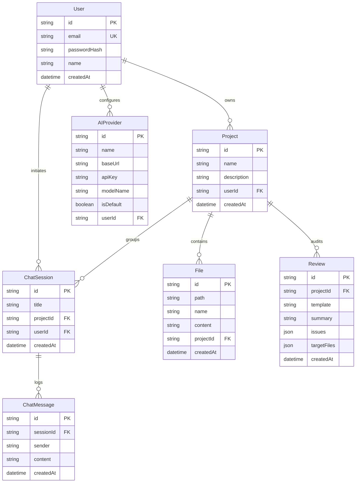
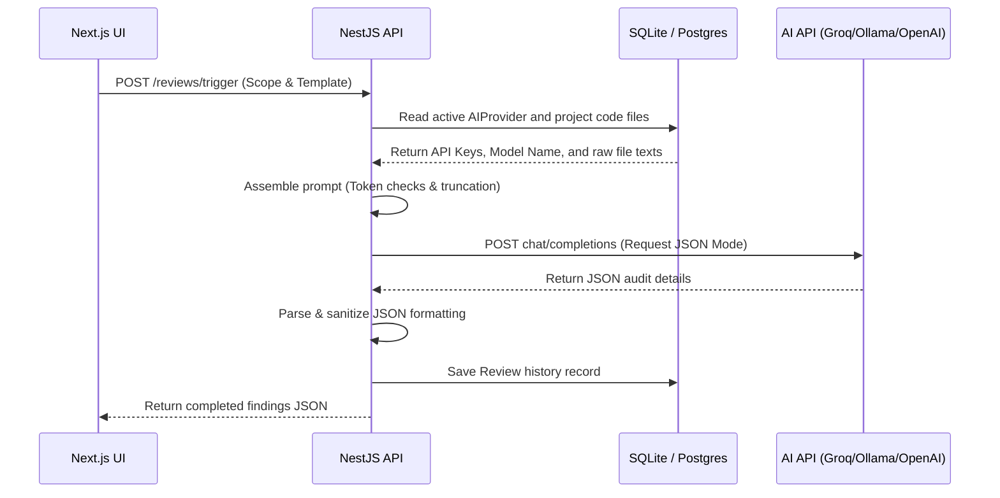

# System Architecture

A breakdown of the technical decisions, data layouts, and execution flow of the AI Code Review Assistant.

---

## 1. Frontend Design

The UI is a React client built on Next.js 15 (App Router) using Tailwind CSS for a minimal, dark theme.

### Key Client Files
- `src/context/AuthContext.tsx`: Manages user sessions, stores JWT tokens in localStorage, and blocks unauthenticated users from accessing protected workspace pages.
- `src/lib/api.ts`: A custom `fetch` wrapper. It automatically injects the current JWT into headers and converts backend JSON error messages into standard catchable JavaScript exceptions.
- `src/app/projects/[id]/page.tsx` (Workspace): A unified 3-pane layout containing:
  - **Left Pane (File Tree)**: Custom recursive component rendering folders first, then sorted files alphabetically.
  - **Middle Pane (Code Viewer)**: Code explorer loading the contents of selected files with PrismJS highlighting.
  - **Right Pane (Control Desk)**: Tabs for reviews (Security, Performance, Quality), chatbot, and scanning utilities.

---

## 2. Backend Design

The server is built with NestJS to enforce structural separation of concerns via modules.

### Code Directory Structure
```text
backend/src/
├── app.module.ts       # Root module declaring imports for all sub-features
├── main.ts             # Server boots, binds CORS, and sets global ValidationPipe
├── auth/               # Passport authentication strategies, JWT signing, password hashes
├── projects/           # REST endpoints for CRUD operations on workspaces
├── files/              # Zip buffer parser, file validation, tree generation
├── ai/                 # Axios clients and dynamic API request handlers for LLMs
└── reviews/            # Prompt templates, output cleaning helpers, database writes
```

### Module Responsibilities
- **AuthModule**: Handles password hashing via `bcrypt` and outputs signed JWT tokens.
- **FilesModule**: Uses `adm-zip` to extract file packages in-memory. Filters out binaries and build artifacts (like `node_modules` and `.git`), then batch-creates file records in the database.
- **AIModule**: Queries the user's custom settings from the database (Base URL, API Key, Model Name) to build adaptive Axios requests, ensuring compatibility with local LLMs (like LM Studio or Ollama) that do not require Authorization headers.
- **ReviewModule**: Builds structured prompt contexts and handles formatting fallback logic if the LLM output is wrapped in markdown code blocks.

---

## 3. Database Schema

The database uses PostgreSQL (accessed via Prisma ORM). The relationship model is mapped below:



---

## 4. Execution Flows & Prompts

### Review Execution


### Context Size Safeguards
To prevent API limits from triggering HTTP 400 errors, the backend estimates the payload size in characters before sending requests:
- **Review Scans**: Triggers a validation error if the project context size exceeds 350,000 characters.
- **RAG Chat sessions**: Sequentially appends files to the prompt budget and stops before exceeding 250,000 characters, appending a notice to the model that some files were omitted.
